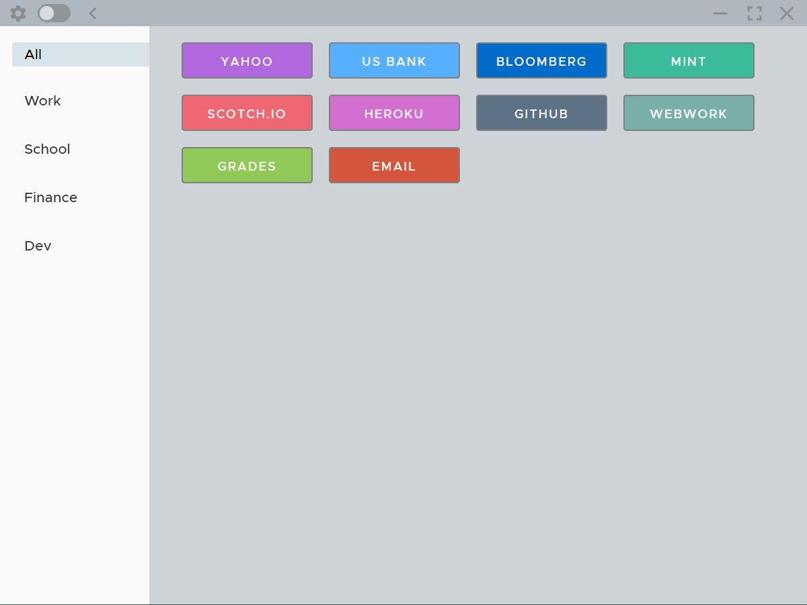
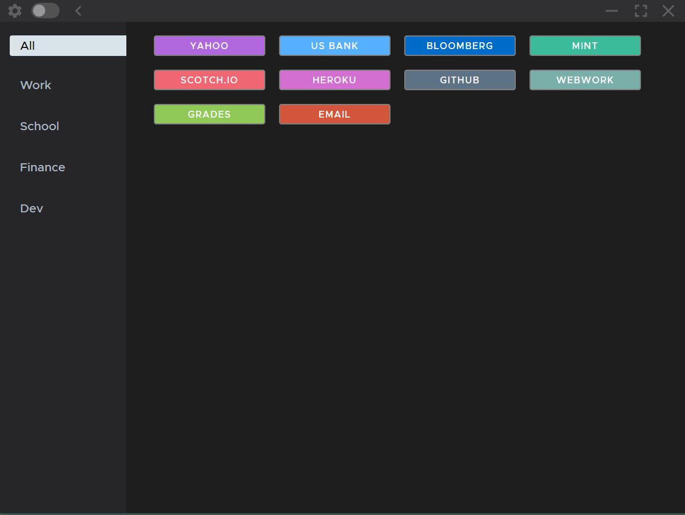
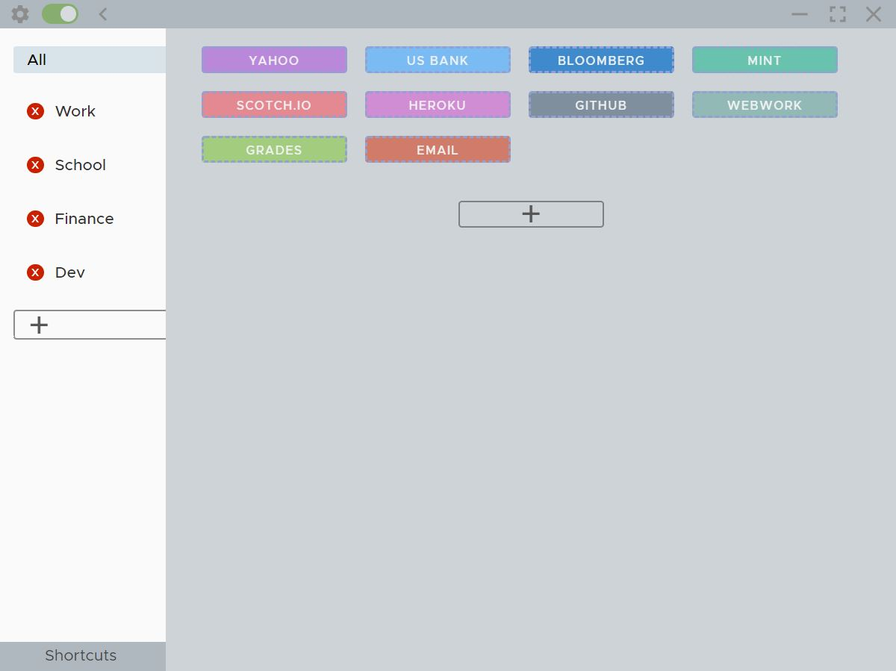
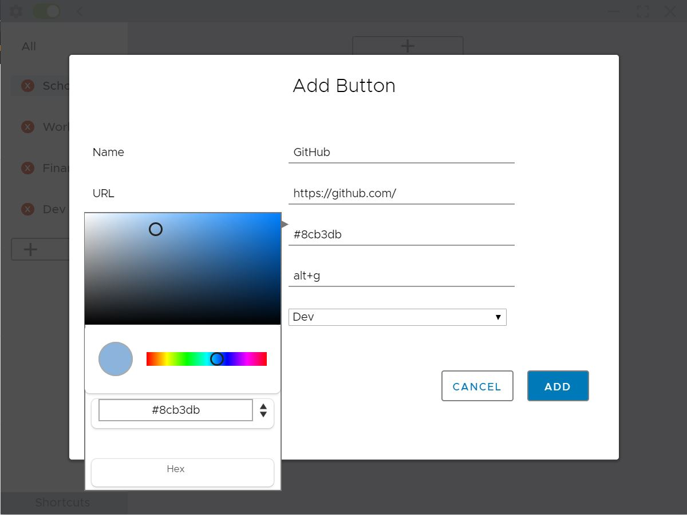
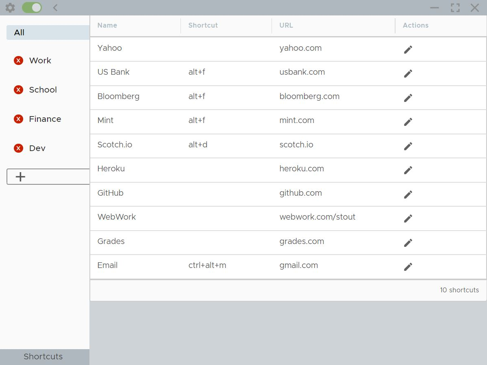

# Basic Bookmark Manager

A desktop application built with [Angular](https://angular.io/), [Electron js](https://electronjs.org/), and [Clarity by VMware](https://github.com/vmware/clarity). Made for people who want quick access to their favorite links stored locally with the ability to create global shortcuts to launch their favorite sites.

## Features
- Customizable, sortable categories
- Customizable bookmark names and colors
- Sortable button layout for bookmarks
- Global shortcuts to launch a website/websites
- Table view for viewing all bookmarks
- Settings for Light/Dark theme, button size, and browser

# Installation

I have not created a signed installer because this application was mainly for practice and personal use. However you can download the packaged electron application with Windows executable [here](https://mega.nz/#!264A3YQD!vuXpdLHXAXYhaSWw6jpNxrdzw8iUg69Nz2TMJlGdPZE) or package the app yourself as seen the below.

## Run using npm
In the applications directory:
- Run ```npm install```
- Run ```ng build --prod```
- Run ```electron .```

## Package the app using [electron-packager](https://github.com/electron-userland/electron-packager)
- Windows: ```electron-packager . application-name --platform=win32 --icon=src/assets/logo2.ico```
- Mac: ```electron-packager . application-name --platform=darwin --icon=src/assets/logo2.ico```

<br>





